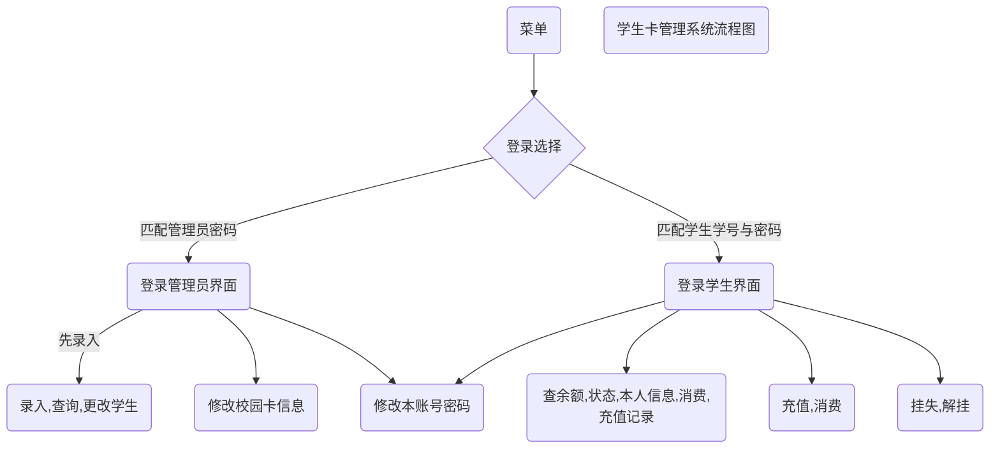

# LabWeek01-Preparations

---

| 姓名 |学号|学院|班级|
|:----:|:----:|:-----:|:----:|
|苏妍文 |19334017|计算机学院|保密管理|

**报告日期：2022-2-18**

---

@[toc]
# 1、熟悉机房工作环境 

 ## 1.1 硬件平台
 - 系统处理器： Intel(R) core(TM) i5-3470 CPU @ 3.20GHz 3.20 GHz
 - 已安装内存(RAM)： 12.0GB (11.6GB 可用) 
 ## 1.2 软件平台
 - 系统版本： Windows 10 专业版 
 - 其他软件：CodeBlocks,Visual Studio Code,Vinzor等等

# 2、熟悉任务管理平台 matrix
matrix从大一用到现在，算是很熟悉了，可以查看课程，公开课，考试等内容，这里查看个人的课程显示如下
| 未结束课程         | 已结束课程 |
| ------------------ | ---------- |
| 软件工程实验       | 程序设计1  |
| 数据结构与算法实验 | 程序设计2  |
| 信息论与编码       | 程序设计2  |


# 3、 熟悉 draw.io (在线工具) 或其他画图工具
这里使用在线的draw.io工具，[draw.io网站](https://app.diagrams.net/)
其中点击右上角的地球符号可以更改语言，改为简体中文


可以很方便地画图表，工程图，流程图，地图，网格图，表格，UML，Venn，线框图等等
点开一个UML模板
里面的图形最主要用到的就是实体关系和UML

打开一个模板图


# 4、 熟悉一个 markdown 编辑器 (可能需要自行下载安装)
  之前也使用过markdown，使用的编辑器是Typora，可以实时渲染查看。不过现在markdwon编辑器的种类也相当多，在线编辑器也能满足大部分功能，可以直接在csdn上编辑编写，上传的图片也能保存在csdn的服务器上，在这边直接进行图片链接引用。
除了基础的语法，一些常用的模板有

- **1、文本样式**
*斜体* 
**加粗** 
==标记==
~~删除~~
> 引用

- **2、插入代码片段**
```c
//c的代码片
int main() {
	return 0;
}
```
- **3、插入mermaid流程图**

- **4、插入LaTex数学公式**
 $a = (n-1)!$

- **5、插入表格**

| 空   | 空   |
| ---- | ---- |
| 空   | 空   |
| 空   | 空   |
| 空   | 空   |


# 5、 建立一个本课程任务的 git 仓库
登录github，创建仓库，仓库名software

取消勾选Add a README file，成功创建本课程任务的git仓库，里面有上传一个新的README file的提示命令

输入以下命令
```
echo "# software" >> README.md
git init
git add README.md
git commit -m "first commit"
git branch -M main
git remote add origin https://github.com/power-on-off/software.git
git push -u origin main
```

登录客户端

刷新界面后

最终的仓库链接：
[https://github.com/power-on-off/software](https://github.com/power-on-off/software)