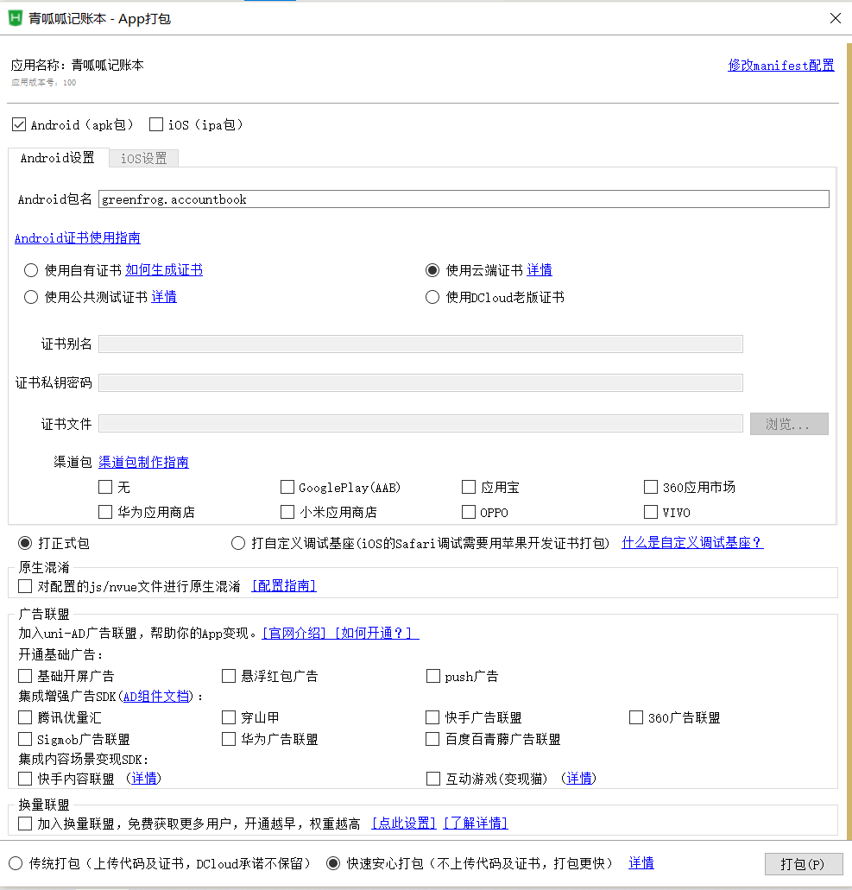

# 1、管理员网页

> 此对应的是服务器 http://lucky.suweb.top/admin  目录下页面

1管理员网页
│  head.html				//页面头部，缓冲区管理/幸运签管理选择
│  login.php				 //设置所有页面共同的访问密码
│  style.css				   //页面全局css
│
├─lucky						 //幸运签
│      delete.php			//删除幸运签
│      index.php			 //幸运签管理首页（展示页面）
│      insert.php			//插入幸运签表单页面
│
└─lucky_log				//缓冲幸运签
        delete.php		  //删除缓冲幸运签
        index.php			//缓冲幸运签管理首页（展示页面）
        insert.php			//插入缓冲幸运签表单页面
        pass.php			  //审核缓冲幸运签

# 2、幸运签数据库

包括数据库数据表的创建以及部分数据的SQL语句

2幸运签数据库
├─lucky_log数据库.sql			//缓冲区幸运签数据库
│      lucky_log_20220603_172946.sql
│
└─lucky数据库.sql				 //幸运签数据库
        lucky_20220603_172938.sql

# 3、幸运签后端api

> 此对应的是服务器 http://lucky.suweb.top/api  目录下

3幸运签后端API
    get.php		       //用户随机获取幸运签/查询幸运签审核情况
    upload.php        //用户上传幸运签

# 4、青呱呱APP目录结构

使用windows tree导出

4青呱呱记账本

│  App.vue						//项目的主组件，页面入口文件
│  main.js						 //初始化vue实例与插件
│  manifest.json			  //应用配置
│  package.json			   //自定义条件编译平台
│  pages.json				   //页面注册
│  uni.scss						//控制应用全局风格
│
├─.hbuilderx
│      launch.json			//配置了启动调试时相关设置
│
├─colorui				  	 //colorui组件文件夹
│  │  animation.css
│  │  icon.css
│  │  main.css
│  │
│  └─components
│          cu-custom.vue
│
├─common					//其他组件和函数
│  │  db.js						//本地数据库操作函数（创建、删除账单、资产、事项表）
│  │  event.js				   //事项函数（删除事项、获取事项）
│  │  util.js					  //与时间相关的函数，以及普通的文本校验
│  │
│  └─u-charts				  //u-charts图标组件（用于画统计图）
│          checker.js
│          u-charts.js
│
├─pages					                //具体页面文件夹
│  ├─census				              //统计
│  │      bill_census.vue            //账单统计页面
│  │      event_census.vue       //事项统计页面
│  │
│  ├─lucky								//幸运签
│  │      lucky_search.vue		//幸运签审核情况页面
│  │      lucky_up.vue				//幸运签上传页面
│  │
│  ├─tabbar							//底部选项栏
│  │  ├─tabbar-1-home		//首页
│  │  │      home.vue			   //首页页面
│  │  │
│  │  ├─tabbar-2-billList       //账单列表
│  │  │      billList.vue             //账单列表页面
│  │  │
│  │  ├─tabbar-3-add			//新增
│  │  │      add.vue				  //添加账单/事项的选择页面
│  │  │
│  │  ├─tabbar-4-eventList	//事项列表
│  │  │      eventList.vue		  //事项列表页面
│  │  │
│  │  └─tabbar-5-data			//个人数据
│  │      │  data.vue				  //个人数据（我的）页面
│  │      │
│  │      └─mydata					//数据操作
│  │              input.vue			  //数据导入
│  │              output.vue		   //数据导出
│  │
│  └─tabbar-3-detial				         //新增
│      ├─bill_add							  	//账单新增
│      │      bill_add_income.vue	 	//新增收入账单
│      │      bill_add_pay.vue				//新增支出账单
│      │
│      └─event_add							 //事项新增
│              event_add_daily.vue		//习惯事项新增
│              event_add_tem.vue		 //临时事项新增
│
├─static						//图片存放
│  │  clock.gif				//闹钟（首页）
│  │  logo.png			   //uni-app的logo（新增选择页面）
│  │  message.png	  //新消息（首页）
│  │
│  ├─event				   //习惯事项图标（首页+事项统计页面）
│  │      learn.png   	 //学习
│  │      live.png			//生活
│  │      other.png		//其他
│  │      ques.png		 //虚席以待的空缺图
│  │      sleep.png		//早睡
│  │      sport.png		//运动
│  │      wake.png		//早起
│  │
│  ├─img					          //图片
│  │  │  bill_income.png	 //新增收入账单选择图
│  │  │  bill_pay.png			//新增支出账单选择图
│  │  │  daily.png				 //新增习惯事项选择图
│  │  │  tem.png				  //新增临时事项选择图
│  │  │  me.png 				  //个人数据页面上方的青蛙
│  │  │
│  │  └─tabbar
│  │          add.png				 //tabbar底部选项栏的加号图
│  │          addactive.png	  //tabbar底部选项栏被点击时的加号图
│  │          frog.png				//tabbar底部选项栏的青蛙图
│  │          frogactive.png	 //tabbar底部选项栏被点击时的青蛙图
│  │
│  └─rank							//习惯事项统计
│          one.png				   //第一名皇冠
│          three.png				//第三名皇冠
│          two.png				   //第二名皇冠
│
└─unpackage					//打包出的内容,打包时自动生成
    ├─cache
    │  │  certdata
    │  │
    │  ├─apk
    │  │      apkurl
    │  │      cmManifestCache.json
    │  │      __UNI__190B556_cm.apk
    │  │
    │  ├─cloudcertificate
    │  │      certini
    │  │      package.keystore
    │  │
    │  └─wgt
    │      └─__UNI__190B556
    │          │  app-config-service.js
    │          │  app-config.js
    │          │  app-service.js
    │          │  app-view.js
    │          │  manifest.json
    │          │  view.css
    │          │  view.umd.min.js
    │          │  __uniappchooselocation.js
    │          │  __uniapperror.png
    │          │  __uniappes6.js
    │          │  __uniappopenlocation.js
    │          │  __uniapppicker.js
    │          │  __uniappquill.js
    │          │  __uniappquillimageresize.js
    │          │  __uniappscan.js
    │          │  __uniappsuccess.png
    │          │  __uniappview.html
    │          │
    │          ├─.manifest
    │          │      icon-android-hdpi.png
    │          │      icon-android-xhdpi.png
    │          │      icon-android-xxhdpi.png
    │          │      icon-android-xxxhdpi.png
    │          │
    │          └─static
    │              │  clock.gif
    │              │  logo.png
    │              │  message.png
    │              │
    │              ├─event
    │              │      learn.png
    │              │      live.png
    │              │      other.png
    │              │      ques.png
    │              │      sleep.png
    │              │      sport.png
    │              │      wake.png
    │              │
    │              ├─img
    │              │  │  bill_income.png
    │              │  │  bill_pay.png
    │              │  │  daily.png
    │              │  │  me.png
    │              │  │  tem.png
    │              │  │
    │              │  └─tabbar
    │              │          add.png
    │              │          addactive.png
    │              │          frog.png
    │              │          frogactive.png
    │              │
    │              └─rank
    │                      one.png
    │                      three.png
    │                      two.png
    │
    ├─dist
    │  ├─build
    │  │  ├─.automator
    │  │  │  └─app-plus
    │  │  │          .automator.json
    │  │  │
    │  │  └─app-plus
    │  │      │  app-config-service.js
    │  │      │  app-config.js
    │  │      │  app-service.js
    │  │      │  app-view.js
    │  │      │  manifest.json
    │  │      │  view.css
    │  │      │  view.umd.min.js
    │  │      │  __uniappchooselocation.js
    │  │      │  __uniapperror.png
    │  │      │  __uniappes6.js
    │  │      │  __uniappopenlocation.js
    │  │      │  __uniapppicker.js
    │  │      │  __uniappquill.js
    │  │      │  __uniappquillimageresize.js
    │  │      │  __uniappscan.js
    │  │      │  __uniappsuccess.png
    │  │      │  __uniappview.html
    │  │      │
    │  │      └─static
    │  │          │  clock.gif
    │  │          │  logo.png
    │  │          │  message.png
    │  │          │
    │  │          ├─event
    │  │          │      learn.png
    │  │          │      live.png
    │  │          │      other.png
    │  │          │      ques.png
    │  │          │      sleep.png
    │  │          │      sport.png
    │  │          │      wake.png
    │  │          │
    │  │          ├─img
    │  │          │  │  bill_income.png
    │  │          │  │  bill_pay.png
    │  │          │  │  daily.png
    │  │          │  │  me.png
    │  │          │  │  tem.png
    │  │          │  │
    │  │          │  └─tabbar
    │  │          │          add.png
    │  │          │          addactive.png
    │  │          │          frog.png
    │  │          │          frogactive.png
    │  │          │
    │  │          └─rank
    │  │                  one.png
    │  │                  three.png
    │  │                  two.png
    │  │
    │  └─dev
    │      ├─.automator
    │      │  └─app-plus
    │      │          .automator.json
    │      │
    │      └─app-plus
    │          │  app-config-service.js
    │          │  app-config.js
    │          │  app-service.js
    │          │  app-view.js
    │          │  manifest.json
    │          │  view.css
    │          │  view.umd.min.js
    │          │  __uniappchooselocation.js
    │          │  __uniapperror.png
    │          │  __uniappes6.js
    │          │  __uniappopenlocation.js
    │          │  __uniapppicker.js
    │          │  __uniappquill.js
    │          │  __uniappquillimageresize.js
    │          │  __uniappscan.js
    │          │  __uniappsuccess.png
    │          │  __uniappview.html
    │          │
    │          └─static
    │              │  clock.gif
    │              │  logo.png
    │              │  message.png
    │              │
    │              ├─event
    │              │      learn.png
    │              │      live.png
    │              │      other.png
    │              │      ques.png
    │              │      sleep.png
    │              │      sport.png
    │              │      wake.png
    │              │
    │              ├─img
    │              │  │  bill_income.png
    │              │  │  bill_pay.png
    │              │  │  daily.png
    │              │  │  me.png
    │              │  │  tem.png
    │              │  │
    │              │  └─tabbar
    │              │          add.png
    │              │          addactive.png
    │              │          frog.png
    │              │          frogactive.png
    │              │
    │              └─rank
    │                      one.png
    │                      three.png
    │                      two.png
    │
    ├─release
    │  └─apk
    │          __UNI__190B556__20220625175031.apk
    │
    ├─res
    │  └─icons
    │          1024x1024.png
    │          120x120.png
    │          144x144.png
    │          152x152.png
    │          167x167.png
    │          180x180.png
    │          192x192.png
    │          20x20.png
    │          29x29.png
    │          40x40.png
    │          58x58.png
    │          60x60.png
    │          72x72.png
    │          76x76.png
    │          80x80.png
    │          87x87.png
    │          96x96.png
    │
    └─resources
        └─__UNI__190B556
            └─www
                │  app-config-service.js
                │  app-config.js
                │  app-service.js
                │  app-view.js
                │  manifest.json
                │  view.css
                │  view.umd.min.js
                │  __uniappchooselocation.js
                │  __uniapperror.png
                │  __uniappes6.js
                │  __uniappopenlocation.js
                │  __uniapppicker.js
                │  __uniappquill.js
                │  __uniappquillimageresize.js
                │  __uniappscan.js
                │  __uniappsuccess.png
                │  __uniappview.html
                │
                └─static
                    │  clock.gif
                    │  logo.png
                    │  message.png
                    │
                    ├─event
                    │      learn.png
                    │      sleep.png
                    │      sport.png
                    │      wake.png
                    │
                    ├─img
                    │  │  bill_income.png
                    │  │  bill_pay.png
                    │  │  daily.png
                    │  │  me.png
                    │  │  tem.png
                    │  │
                    │  └─tabbar
                    │          add.png
                    │          addactive.png
                    │          frog.png
                    │          frogactive.png
                    │
                    └─rank
                            one.png
                            three.png
                            two.png

# APP打包时具体的配置：

